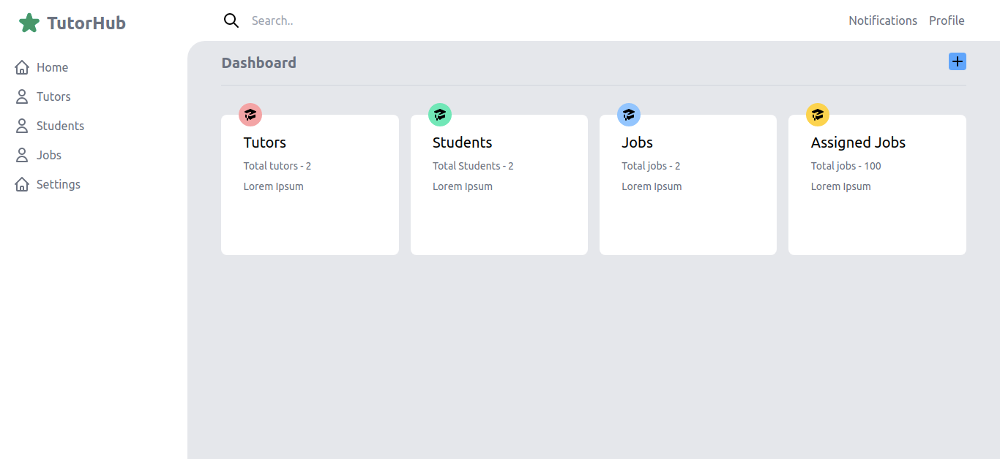

## Tutorhub  
 A website used to find tuitions and tutors built with Next.js,  JavaScript, Strapi, Graphql and Tailwind CSS.

### Project Demo

<!-- View live website [WriteUp](http://tasfiaislam.github.io/react-blog) -->

1.Dashboard
   

---


### Installation and Setup Instructions

```bash
clone the project
git clone https://github.com/TasfiaIslam/Tutorhub.git
```
- Backend
```bash
cd backend
npm run develop

#Then visit http://localhost:1337/admin to view the backend.
```

- Frontend 
```bash
cd frontend
npm run dev

#Then visit http://localhost:3000 to view the app.
```


